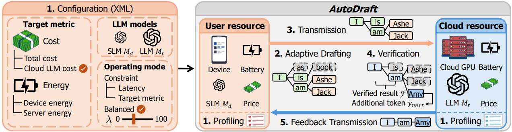
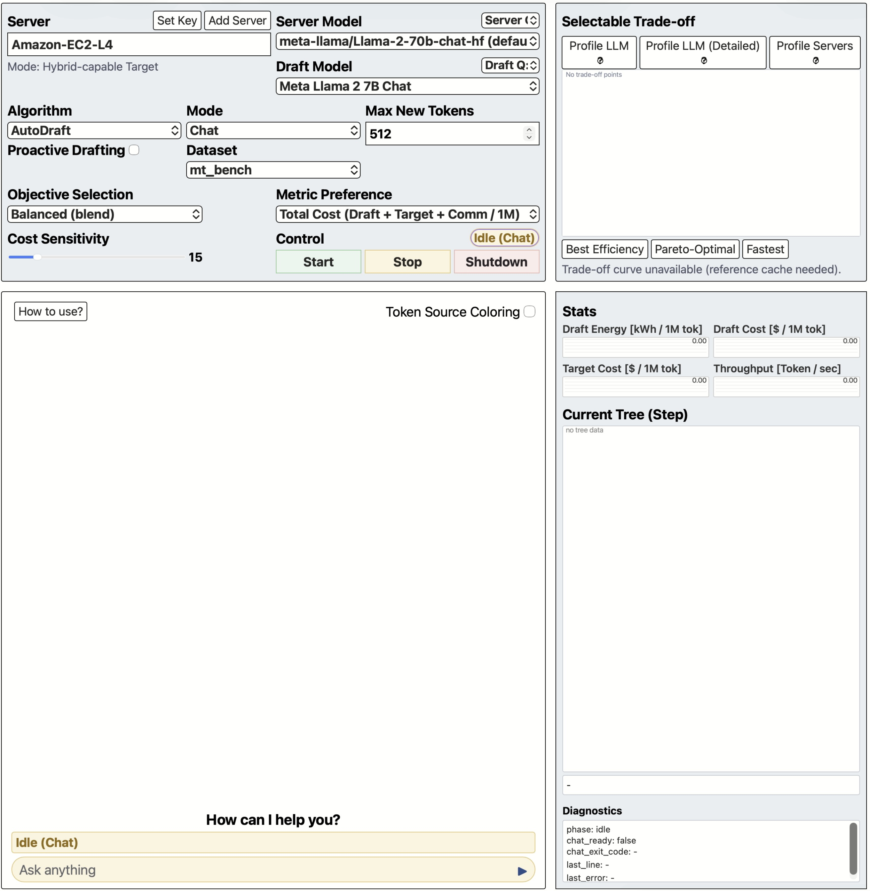

# *AutoDraft*: Automatic Cost-Performance Adaptation in User-Cloud Distributed Speculative Decoding

---
This repository is the official implementation of "AutoDraft: Automatic Cost-Performance Adaptation in User-Cloud Distributed Speculative Decoding," submitted to NeurIPS 2026.

## Abstract

As demand for on-cloud Large Language Models (LLMs) explodes, the high inference cost has become a critical issue. Recently, user-cloud distributed speculative decoding has emerged as a promising paradigm, wherein a lightweight draft model on the user device generates candidate tokens while a large target model on the cloud server verifies them in parallel. However, existing approaches rely on static configurations, overlooking the heterogeneous performance of user devices and the alignment between draft and target models. This rigidity leads to redundant resource utilization. To this end, we propose *AutoDraft*, an adaptive framework that navigates the cost-performance trade-off by continuously profiling the execution environment and dynamically configuring the draft tree structure (width, depth, and transmitted nodes) in real-time to accommodate diverse user-defined Service Level Objectives (SLOs), including monetary cost and inference throughput. Extensive evaluations demonstrate that *AutoDraft* achieves 79\% lower Cloud LLM cost and 44\% higher throughput compared to server-only baseline. Furthermore, we encapsulate these technical optimizations into an accessible API, allowing users to effortlessly input their desired constraints and dynamically control the framework without requiring deep system expertise.



---

## Getting Started

AutoDraft is an **adaptive tree-based user-cloud distributed speculative decoding** framework. It consists of two cooperating processes:

1. **Server process** — runs the *target model* and verifies the draft tree.
2. **User process** — runs the *draft model* and builds an adaptive token tree.

> **The server process must be launched first**, because the user process opens a socket to the server immediately on start. Always boot the server, wait until it is listening, and then launch the user process (or the UI / config-driven runner that drives it).

We support two ways of bringing them up: a **PyPI library** (drop-in Python API) and a **GitHub repository** (full source, UI, configurable scripts).

---

## Contents

1. [Python library usage](#1-python-library-usage)
   - 1.1 [Install the library](#11-install-the-library)
   - 1.2 [Server process example](#12-server-process-example)
   - 1.3 [User process example](#13-user-process-example)
2. [GitHub repository usage](#2-github-repository-usage)
   - 2.1 [Prerequisites](#21-prerequisites)
   - 2.2 [Installation](#22-installation)
   - 2.3 [Running](#23-running)
3. [Configure runs via an XML file](#3-configure-runs-via-an-xml-file)

---

## 1. Python library usage

### 1.1 Install the library

```bash
pip install autodraft-sd
```

### 1.2 Server process example

Run this **first**, on the machine that will host the target model. It blocks forever (server loop), so leave the terminal open.

```python
from autodraft import serve_target

serve_target(
    host="0.0.0.0",                  # bind address of the server process
    port=26001,                      # port to listen on
    server_name="autodraft",
    hf_token=None,                   # gated repos: pass token here or set HF_TOKEN
)
```

### 1.3 User process example

Once the server is up, run this on the user device. It connects to the server at `target_host:target_port` and uses it to verify the draft tree.

```python
from autodraft import Autodraft

engine = Autodraft(
    draft_model="meta-llama/Llama-3.2-1B-Instruct",
    target_model="meta-llama/Llama-3.2-1B-Instruct",
    draft_quantization="4bit",       # "none" / "4bit" / "8bit"
    target_quantization="4bit",      # "none" / "4bit" / "8bit"
    target_host="127.0.0.1",         # IP address of the server process
    target_port=26001,               # port the server process listens on
    cost="draft_energy",             # "total_cost" (default) / "api_cost"
                                     # also supports "draft_energy" / "target_energy"
    hf_token=None,                   # pass token here or set HF_TOKEN env var
)

result = engine.run(
    input_text="...",
    proactive=False,
    cs="balanced",                   # "tps" / "balanced" (default) / "cost", or a 0~1 number
    save_tradeoff=True,              # save the reference trade-off curve (default True)
    tradeoff_dir=None,               # default: $AUTODRAFT_DATA_DIR/tradeoff
    server_name="autodraft",         # must match the server's server_name
    # Any other run_draft kwargs (~70 options) are forwarded as-is.
)
```

---

## 2. GitHub repository usage

### 2.1 Prerequisites

- NVIDIA driver
- Python 3.10 or newer
- `git`

### 2.2 Installation

**2.2.1 Get the project**

```bash
git clone https://github.com/autodraft26/AutoDraft2026.git
cd AutoDraft2026
```

**2.2.2 Virtual environment + install requirements**

```bash
python3 -m venv .venv
source .venv/bin/activate
python -m pip install --upgrade pip setuptools wheel
pip install -r requirements.txt
```

### 2.3 Running

> Bring the server up **first**, then the UI / user side.

**2.3.1 Launch the server process** — in terminal A:

```bash
source .venv/bin/activate
./run_target.sh --host 0.0.0.0 --port 26001 --device-map auto \
                --load-in-8bit --lazy-load --enable-auto-target-profile \
                --server-name EC2-A100
```

Wait until you see the server log indicating that it is listening on the port (lazy-load mode means no model is loaded yet — that happens when the user side connects).

**2.3.2 Launch the UI** — in terminal B:

```bash
source .venv/bin/activate
python3 -m uvicorn chat_ui.main:app --host 0.0.0.0 --port 8000
```

Open in your browser: <http://localhost:8000>



**2.3.3 Register the server in the UI**

In the browser UI:

1. Click `Add Server`.
2. Enter `Server Name` — the same value you passed to `--server-name` in step 2.3.1.
3. Enter `IP Address`.
4. Enter `Port`.
5. Click `Add Server`.

**2.3.4 Pick a server / model and start**

Starting from the registered server, select in this order:

1. Pick the server from the `Server` dropdown.
2. Pick the target model under `Server Model`.
3. Pick the draft model under `Draft Model`.
4. Pick quantization (4bit / 8bit) under `Server Q` / `Draft Q`.
5. Click `Start` to launch the runtime, then send a message.


---

## 3. Configure runs via an XML file

Instead of typing many command-line flags every time, you can keep all run settings — models, dataset, cost objective, tree size, etc. — in a single XML file and point the runner at it. This makes it easy for users to tweak just the values they care about, and it makes a run reproducible by sharing the same XML file.

```bash
bash evaluation/run_main_experiment_overall_performance.sh \
     --config-xml evaluation/overall_performance_draft_energy_humaneval_example.xml
```

Two example configs ship with the repo (copy and edit them):

- `evaluation/overall_performance_draft_energy_humaneval_example.xml` — HumanEval, draft-energy objective.
- `evaluation/overall_performance_total_cost_mt_bench_example.xml` — MT-bench, total-cost objective.

### 3.1 Cost models

Every cost knob the framework supports is exposed as an explicit XML tag inside `<objective>`, so users can edit them directly in the XML rather than chasing the default through CSV files. Pick the cost objective via `OBJECTIVE_METRICS_CSV` and edit the knobs that matter for it:

| `OBJECTIVE_METRICS_CSV` | Knobs consumed | What it measures |
|---|---|---|
| `total_cost`    | `TARGET_PER_HOUR_COST`, `DRAFT_ELECTRICITY_COST_PER_KWH`, `USER_COMM_COST_PER_GB`, `CLOUD_OUTBOUND_COST_PER_GB` | Draft GPU $ + Target GPU $ + Communication $ |
| `api_cost`      | `TARGET_PER_HOUR_COST`        | Target API $ |
| `draft_energy`  | _(none — measured via NVML)_  | Draft GPU kWh |
| `target_energy` | _(none — measured via NVML)_  | Target GPU kWh |

Excerpt (`overall_performance_total_cost_mt_bench_example.xml`):

```xml
<objective>
  <!-- Pick one (comma-separated for sweeps):
       total_cost / api_cost / draft_energy / target_energy -->
  <OBJECTIVE_METRICS_CSV>total_cost</OBJECTIVE_METRICS_CSV>

  <!-- 0 = TPS-first, 1 = cost-first; space-separated for a sweep -->
  <AUTODRAFT_CS_LIST>0</AUTODRAFT_CS_LIST>

  <!-- Cost-model parameters. Knobs are ignored for energy_* objectives. -->
  <TARGET_PER_HOUR_COST>1.208</TARGET_PER_HOUR_COST>          <!-- $/h cloud GPU/API; used by: total_cost, api_cost -->
  <DRAFT_ELECTRICITY_COST_PER_KWH>0.2</DRAFT_ELECTRICITY_COST_PER_KWH>   <!-- $/kWh user side, multiplied by measured draft kWh; used by: total_cost -->
  <USER_COMM_COST_PER_GB>0.33</USER_COMM_COST_PER_GB>          <!-- $/GB user→cloud; used by: total_cost -->
  <CLOUD_OUTBOUND_COST_PER_GB>0.09</CLOUD_OUTBOUND_COST_PER_GB>  <!-- $/GB cloud→user; used by: total_cost -->
</objective>
```

The same `<objective>` block lives in the `draft_energy` example too (with the dollar knobs marked "for reference / easy switching") so you can flip from energy to total-cost just by editing `OBJECTIVE_METRICS_CSV` — no other surgery needed.

### 3.2 Other config blocks

The XML also has runtime / models / dataset / algorithms / tree blocks. Excerpt:

```xml
<runtime>
  <TARGET_HOST>192.168.0.12</TARGET_HOST>
  <TARGET_PORT>26001</TARGET_PORT>
  <DEVICE_MAP>cuda:0</DEVICE_MAP>
  <DRAFT_DEVICE_NAME>rtx5080</DRAFT_DEVICE_NAME>
  <SERVER_NAME>rtxproa6000</SERVER_NAME>
</runtime>

<models>
  <BASE_MODEL_PATH>Qwen/Qwen2.5-14B-Instruct</BASE_MODEL_PATH>
  <DRAFT_MODEL_PATH>Qwen/Qwen2.5-1.5B-Instruct</DRAFT_MODEL_PATH>
  <TARGET_QUANTIZATION>none</TARGET_QUANTIZATION>
  <DRAFT_QUANTIZATION>none</DRAFT_QUANTIZATION>
</models>

<dataset><BENCHES_CSV>mt_bench</BENCHES_CSV></dataset>

<algorithms><ENABLE_HYBRID_AUTODRAFT>1</ENABLE_HYBRID_AUTODRAFT></algorithms>

<tree>
  <PROPOSED_NODES>150</PROPOSED_NODES>
  <PROPOSED_MAX_DEPTH>15</PROPOSED_MAX_DEPTH>
  <!-- ... profile width / node lists ... -->
</tree>
```

The same rule applies here: the server process (`run_target.sh`) must already be running on `TARGET_HOST:TARGET_PORT` before you launch the runner.

We gratefully acknowledge that this project uses code from [OPT-Tree](https://github.com/Jikai0Wang/OPT-Tree).
